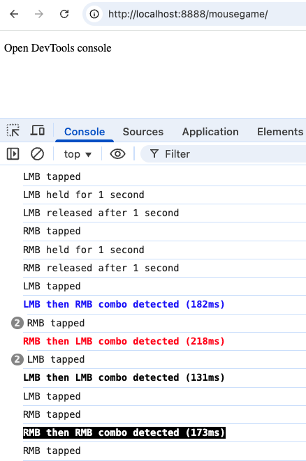

# Mouse Events Engine


<a target="_blank" href="https://github.com/Siphon880gh" rel="nofollow"></a>
<a target="_blank" href="https://www.linkedin.com/in/weng-fung/" rel="nofollow"></a>
<a target="_blank" href="https://www.youtube.com/@WayneTeachesCode/" rel="nofollow"></a>

By Weng Fei Fung. 

This engine is useful for creating web games or interfaces where you need to destinguish single clicks on the left mouse button (LMB) or right mouse button (RMB), or to execute code when user holds the mouse click (LMB or RMB) for some time, or to execute that code when the user releases that mouse holding. It can also detect if the user clicks in quick succession RMB -> LMB or RMB -> LMB. 

Engine in action at DevTools console:



Sometimes you don't want to detect quick succession of the same button (eg. LMB->LMB, or RMB->RMB) because those clicks each executes the same code (Eg. spamming woodchopping in a game). Disable the double click events with:
```
const mouseGame = new MouseGameAPI({
     enabledLmbToLmbCombo: false,
     enabledRmbToRmbCombo: false,
});
```

You can provide custom handlers for each mouse event. That would remove the console log but will execute your provided code in lieu of the console log.

```
 * @property {function} [onLeftTap] - Handler for left mouse button tap
 * @property {function} [onRightTap] - Handler for right mouse button tap
 * @property {function} [onLeftHold] - Handler for left mouse button hold (1 second)
 * @property {function} [onRightHold] - Handler for right mouse button hold (1 second)
 * @property {function} [onBothHold] - Handler for both mouse buttons held (1 second)
 * @property {function} [onLeftRelease] - Handler for left mouse button release after hold
 * @property {function} [onRightRelease] - Handler for right mouse button release after hold
 * @property {function} [onBothRelease] - Handler for both buttons release after hold
 * @property {function} [onRmbToLmbCombo] - Handler for right-to-left mouse button combo
 * @property {function} [onLmbToRmbCombo] - Handler for left-to-right mouse button combo
 * @property {function} [onLmbToLmbCombo] - Handler for double left mouse button combo
 * @property {function} [onRmbToRmbCombo] - Handler for double right mouse button combo
```

If your game or app sometimes supposed to listen to mouse events and at other times does not (for example, goes back to normal mouse click interaction with a webpage interface), you can pass a function that the engine checks before executing any custom handlers or console logging:
```
const mouseGame = new MouseGameAPI({
    checkEnabled: () => {
        // Example: only allow mouse events when a certain condition is met
        return document.body.classList.contains('mouse-events-enabled');
    },
});
```

^ In this example, if the `<body>` element has the class `mouse-events-enabled`, then the mouse event engine is ON. You can have JS that removes/adds this class for a more dynamic use case.

If you have different mouse event handlers for different parts of your app or game, you could initiate different instances of MouseGameAPI each with checkEnabled that passes true when appropriate.