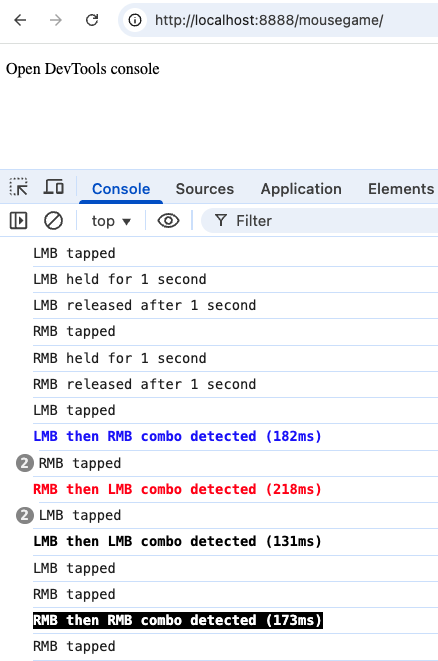
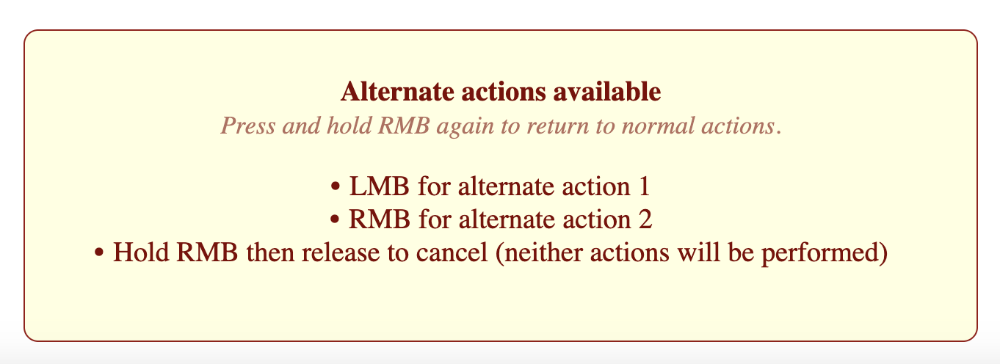

# Mouse Events Engine


<a target="_blank" href="https://github.com/Siphon880gh" rel="nofollow"></a>
<a target="_blank" href="https://www.linkedin.com/in/weng-fung/" rel="nofollow"></a>
<a target="_blank" href="https://www.youtube.com/@WayneTeachesCode/" rel="nofollow"></a>

By Weng Fei Fung. 

This engine is useful for creating web games or interfaces where you need to destinguish single clicks on the left mouse button (LMB) or right mouse button (RMB), or to execute code when user holds the mouse click (LMB or RMB) for some time, or to execute that code when the user releases that mouse holding. It can also detect if the user clicks in quick succession RMB -> LMB or RMB -> LMB. 

## Engine in action at DevTools console:



## Usage

Simply initiate a new instance:
```
const mouseGame = new MouseGameAPI();

// Initialize the game
mouseGame.init();
```

MouseGameAPI can receive optional settings object.

For example, sometimes you don't want to detect quick succession of the same button (eg. LMB->LMB, or RMB->RMB) because those clicks each executes the same code (Eg. spamming woodchopping in a game). Disable the double click events with:
```
const mouseGame = new MouseGameAPI({
     enabledLmbToLmbCombo: false,
     enabledRmbToRmbCombo: false,
});
```

You can provide custom handlers for each mouse event. That would remove the console log but will execute your provided code in lieu of the console log.

```
 * @property {function} [onLeftTap] - Handler for left mouse button tap
 * @property {function} [onRightTap] - Handler for right mouse button tap
 * @property {function} [onLeftHold] - Handler for left mouse button hold (1 second)
 * @property {function} [onRightHold] - Handler for right mouse button hold (1 second)
 * @property {function} [onLeftRelease] - Handler for left mouse button release after hold
 * @property {function} [onRightRelease] - Handler for right mouse button release after hold
 * @property {function} [onRmbToLmbCombo] - Handler for right-to-left mouse button combo
 * @property {function} [onLmbToRmbCombo] - Handler for left-to-right mouse button combo
 * @property {function} [onLmbToLmbCombo] - Handler for double left mouse button combo
 * @property {function} [onRmbToRmbCombo] - Handler for double right mouse button combo
```

If your game or app sometimes supposed to listen to mouse events and at other times does not (for example, goes back to normal mouse click interaction with a webpage interface), you can pass a function that the engine checks before executing any custom handlers or console logging:
```
const mouseGame = new MouseGameAPI({
    checkEnabled: () => {
        // Example: only allow mouse events when a certain condition is met
        return document.body.classList.contains('mouse-events-enabled');
    },
});
```

^ In this example, if the `<body>` element has the class `mouse-events-enabled`, then the mouse event engine is ON. You can have JS that removes/adds this class for a more dynamic use case.

If you have different mouse event handlers for different parts of your app or game, you could initiate different instances of MouseGameAPI each with checkEnabled that passes true when appropriate.


---

## Combo Threshold Override

Combo threshold defaults to 350ms unless overridden by comboThreshold

Had we set the comboTreshold to 2000
```
// Initialize the game
const mouseGame = new MouseGameAPI({
    comboThreshold: 2000
});
mouseGame.init();
```

Left click then right click will trigger a LMB->RMB event as long as your quick successions are within 2 seconds (because you’ve set 2000ms). The default if you haven’t set the comboThreshold would be a much more reasonable 350ms because usually it’s a quick succession of mouse clicks that you want to trigger the event (and a slow succession of mouse clicks you probably want to trigger as two individual events in your game / app).
```
engine.js:45 LMB tapped
engine.js:45 LMB then RMB combo detected (1650ms)
engine.js:37 RMB tapped
engine.js:44 RMB then LMB combo detected (940ms)
engine.js:36 LMB tapped
engine.js:45 LMB then RMB combo detected (1560ms)
engine.js:37 RMB tapped
```


---

## Hold Threshold Override

Hold threshold defaults to 1000ms unless overridden by holdThreshold. It’s the amount of time needed to register holding LMB or RMB for hold trigger or hold-and-release trigger.

Had we set the holdTreshold to 3000
```
// Initialize the game
const mouseGame = new MouseGameAPI({
    holdThreshold: 3000
});
mouseGame.init();
```

Holding either the LMB or the RMB doesn’t trigger the “holding” event until your held for a full 3 seconds (because you’ve set 2000ms). Letting go of the mouse click will trigger the “released” event as long as you’ve held on the mouse button passed 3 seconds. The default if you haven’t set the comboThreshold would be a much more reasonable 1 second because that 1 second. could be perceived as a long time to the user (and normal click events mean the mouse click is released at fractions of a second).

- If held LMB for 4 seconds and released:
    ```
    engine.js:41 LMB held for 3.00 second
    engine.js:41 LMB released after 4.00 second
    ```

- If held LMB for 1 seconds and released, for our overridden example, there is no event or console log. It won’t even register as a single LMB click.


---

## Advanced Patterns

By combining custom handlers with global flags in your app, you can have more complex mouse to trigger behaviors.

### Clean Combo Event

If your use case doesn’t require rapid-fire actions from spamming the left mouse button (LMB), you can distinguish between a single click and a combo click, triggering only one of the two events—instead of firing a click event, a combo event, and possibly another click event, when you click in a quick succession of either LMB then RMB, or RMB then LMB. Console log looking like:
```
LMB tapped
engine.js:45 LMB then RMB combo detected (149ms)
engine.js:37 RMB tapped
```

You want only:
```
engine.js:45 LMB then RMB combo detected (149ms)
```

To do this, use a global flag to manage LMB clicks. Set the flag to true when LMB is clicked. Then, after a timeout (e.g., your desired threshold plus 100ms), check if the flag is still true. 
- If so, execute the single-click action. In either case, reset the flag to false. 
- If the user clicks LMB followed by the right mouse button (RMB), trigger the combo action immediately and reset the flag.

This requires adding a threshold to detect the succession and to trigger the click event if no second click detected within the threshold. This means it is not suitable for games or apps that allow user to spam the LMB (or the RMB) to perform a series of actions (eg. Having a unit perform more rapid woodchopping in a RTS game). Another side effect is that the action for the user clicking the LMB is delayed because it waits to check if a RMB gets clicked.

When the LMB->RMB event triggers, the RMB click event also triggers usually right after. So during the LMB->RMB event, you should set a global flag for LMB->RMB having occured. At the RMB event handler, check if this flag exists:
- If the flag is true, do not execute RMB action. However, do reset the flag back to false.
- If the flag is false, execute the RMB action as usual.

### Alternate group of mouse events

If your use case requires more mouse actions, you can designatre a RMB hold-then-release as a way to enter the alternate mouse menu. When alernate mode is on, you would have your app display instructions to LMB for alternate action 1 or RMB for alternate action 2 or hold RMB again to cancel and return to the normal mouse click actions. Your logic and flags can be as follows:

Create a function that turns this box on and off:


- The code could look like example-rmb-hold-alt-options.js':
```
function toggleAlternateActionsHint() {
    const alternateActionsHintElement = document.getElementById("alternate-actions-hint");
    alternateActionsHintElement.classList.toggle("visible");
}
```

When user holds RMB, show alternate actions message and also set flag isRmbHeld to true

On LMB or RMB click, check if isRmbHeld flag is true. 
- If true, perform alternate action and dismiss the alternate actions message.
- If false, perform default action.

If instead, user holds RMB and then releases again, set isRmbHeld to false and dismiss the alternate actions message. This is considered a cancel.

## Complied with Apple Mac Limitations

Mac has a serious limitation where if you press both LMB and RMB, it cannot detect that both are being pressed. The reason why is that Apple never cared to adapt their mouse events to the mouse. The Mac trackpad is either one click for LMB or two finger click for RMB.

Therefore, our code does not have simultaneous LMB and RMB detection. If you choose to edit the engine to implement the simultaneous event, you should warn your users or game players that Mac is not supported.